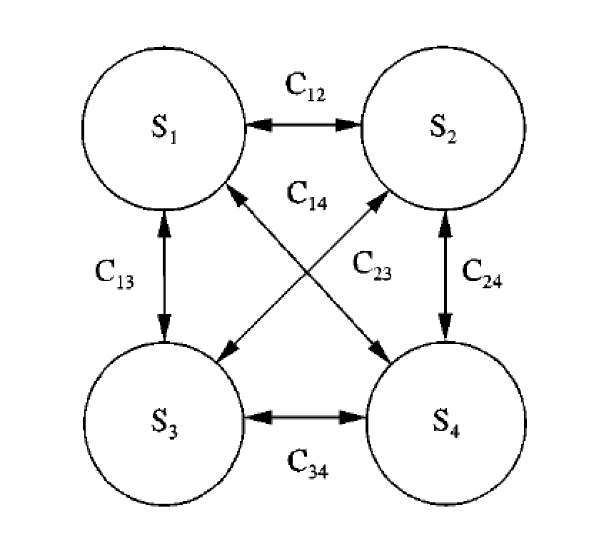

```{r setup, include=FALSE}
knitr::opts_chunk$set(echo = FALSE)
```

# The most important thing I ever did

## Informal education


# Undergraduate

## BSc Forensic & Analytical Chemistry (1992-1996)

* Mostly chemistry (1yr industry)
* Final year forensics
* Final year honours project: proteins and computers


## Body Fluid Analysis (1996)

* Glasgow Royal Infirmary


# Postgraduate

## PhD Bioinformatics (1996-1999)

* Evolution of snake venom toxins
* Neural network analogy of protein evolution
* Drug site discovery algorithm (still in use)





## Postdocs (1999-2003)

* Systems Biology
* Modelling of yeast metabolism
* Directed evolution


# The SCRI/JHI Years

## Bioinformatician (2003-present)

* Research Institute
* Bioinformatician/Computational Biologist
* Not a clear postdoc/PI distinction
* Ineligible for many usual funding sources (e.g. RCUK)
* BA Mathematics (Open University)

# Bacterial Genomes

## 2003: Erwinia

* Arrived at SCRI part-way through sequencing *Erwinia carotovora* subsp. *atrosepticum*


([http://sulab.org/2013/06/sequenced-genomes‐per‐year/](h5p://sulab.org/2013/06/sequenced‐genomes‐per‐year/))

## Global pathogens

* Blackleg, stem-rot
* Quarantine pathogen


## First enterobacterial plant pathogen genome


* Bell *et al.* (2004) *Proc. Natl. Acad. Sci. USA* [doi:10.1073/pnas.0402424101](https://dx.doi.org/doi:10.1073/pnas.0402424101)

## First enterobacterial plant pathogen genome

* 32-author bacterial genome paper!
* £250,000 collaboration between SCRI, University of Cambridge, Wellcome Trust Sanger Institute
* All repeats and gaps bridged and sequenced directly
* A single complete high-quality 5Mbp circular chromosome
* 3 person-years' manual annotation

s