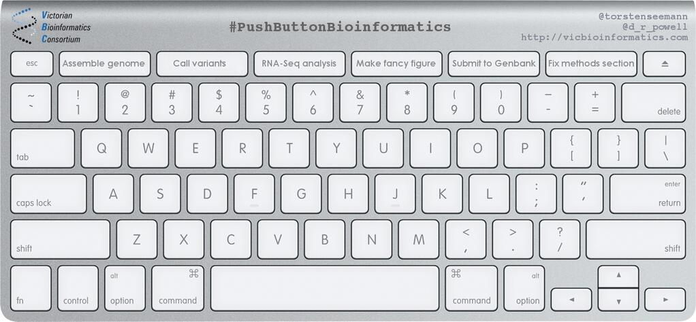
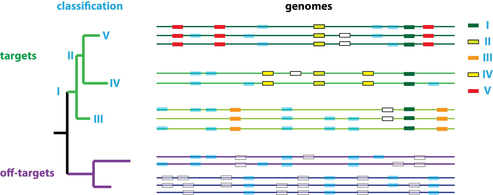
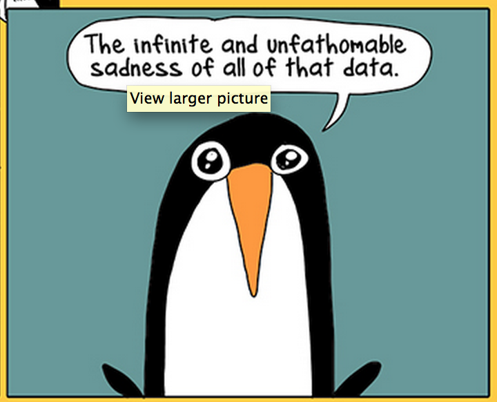

```{r setup, include=FALSE}
knitr::opts_chunk$set(echo = FALSE)
```

## My life in sequences


A wonky path to bioinformatics

## A confession


# The single most important influence on my academic career

## Informal education


## Informal education


# Formal Education

## BSc Forensic & Analytical Chemistry (1992-1996)

* Mostly chemistry (1yr industry), final year forensics
* Final year honours project: proteins and computers
* Sinclair Basic and Frontier: Elite II


## Body Fluid Analysis (1996)

* Glasgow Royal Infirmary


## Making the switch


## PhD (1996-1999)

* Evolution of snake venom toxins (correlated mutations)
* Neural network model of protein evolution
* Drug active site discovery algorithm (still in use)


[doi:10.1006/jmbi.1998.2437](https://dx.doi.org/10.1006/jmbi.1998.2437); 
[doi:10.1006/jtbi.1999.1043](https://dx.doi.org/10.1006/jtbi.1999.1043); 
[PMID:11579223](https://www.ncbi.nlm.nih.gov/pubmed/11579223); 
[PMID:12676977](https://www.ncbi.nlm.nih.gov/pubmed/12676977)

# First steps in academia

## First steps in academia


## Postdocs (1999-2003)

* Systems biology: modelling yeast metabolism
* Directed evolution: improved lanthanide binding


[doi:10.1046/j.1432-1033.2002.03055.x](https://dx.doi.org/10.1046/j.1432-1033.2002.03055.x); 
[doi:10.1016/j.jtbi.2004.12.005](https://dx.doi.org/10.1016/j.jtbi.2004.12.005)

## Multidisciplinarity


# The SCRI/JHI Years

## The SCRI/JHI Years


<br></br>


## Bioinformatician (2003-present)

* Research Institute
* Government funding, policy remits
* Ineligible for many usual funding sources (e.g. RCUK)
* Bioinformatician/Computational Biologist
* Not a clear postdoc/PI distinction
* BA Mathematics (Open University)

## Bioinformatician (2003-present)

* Bacterial genomics
* Plant-microbe interactions
* Oomycete genomics
* Microbial systems biology
* Microbial synthetic biology
* (occasionally plants, fungi, nematodes and viruses)

# Bacterial Genomics I

## 2003: Erwinia

* Arrived at SCRI part-way through sequencing *Erwinia carotovora* subsp. *atrosepticum*


([http://sulab.org/2013/06/sequenced-genomes‐per‐year/](h5p://sulab.org/2013/06/sequenced‐genomes‐per‐year/))

## Global pathogens

* Blackleg, stem-rot
* Quarantine pathogens


Toth *et al.* (2011) [doi:10.1111/j.1365-3059.2011.02427.x](https://dx.doi.org/10.1111/j.1365-3059.2011.02427.x)

## First enterobacterial plant pathogen genome
 


 [doi:10.1073/pnas.0402424101](https://dx.doi.org/doi:10.1073/pnas.0402424101)

## Acceptable in the 00s…

* 32-author single bacterial genome paper!
* £250,000 collaboration between SCRI, University of Cambridge, Wellcome Trust Sanger Institute
* All repeats and gaps bridged and sequenced directly
* A single complete high-quality 5Mbp circular chromosome
* 3 person-years' manual annotation

## TIL: Annotation

* The utility of genomes depends on annotation
* Annotation is **curation**, not cataloguing
* Automated annotation from curated data (e.g. with `Prokka`) now the only game in town
* ***But** you can't propagate what doesn't exist*
* Lots of genomes, few incentives to curate well: "many parents, but no-one wants to look after the children"
* Centralised data resources (e.g. PhytoPath) only a partial solution (funding?)

## TIL: Comparisons

* The real power of genomics is **comparative genomics**
* $\textrm{genome} \implies \textrm{heritable}$
* identification of functional elements, evolutionary processes and constraints
* **But** epigenetics, tissue differentiation, mesoscale, phenotype plasticity, …


## Comparisons

* So we compared *Pba* to the 130 prokaryotic genomes available at the time…


[doi:10.1146/annurev.phyto.44.070505.143444](https://dx.doi.org/10.1146/annurev.phyto.44.070505.143444)

## Functional differences

* *Pba*-only: pathogenicity determinants; phage/IS elements
* *Pba* & environmental: pathogenicity determinants; surface proteins; regulatory proteins


# Visualisation

## Visualisation


## GenomeDiagram


<br></br>


[doi:10.1093/bioinformatics/btk021](https://dx.doi.org/10.1093/bioinformatics/btk021)

## `Biopython`/`KGML`


<br></br>


[http://biopython.org](http://biopython.org)

## Art/Science


* Elaine Shemilt, exhibited Singapore, Dundee, London

[A Blueprint for Bacterial Life and Art](https://www.dundee.ac.uk/djcad/research/researchprojectscentresandgroups/blueprint/)

# Bacterial Genomics II

## Bacterial genomics II


## SPI-7 & *cfa*

* 11 horizontally-acquired islands: one similar to a *P. syringae* phytotoxin synthesis island (payload swapped)


## SPI-7 & *cfa*

* Island present in *Pba*, some *Pcc*, no *Dickeya*
* *cfl* and *cfa7* Tn mutants showed reduced virulence (17dpi)


Slawiak & Lojkowska (2009) [doi:10.1007/s10658-008-9418-7](10.1007/s10658-008-9418-7)

## 2013: Dickeya

* Genomics commodified (several services used)
* 25 genomes, no fanfare, minor publications


* 6 species, draft genomes, automated annotation

[doi:10.1128/genomeA.00978-13](https://dx.doi.org/10.1128/genomeA.00978-13)
[doi:10.1128/genomeA.00087-12](https://dx.doi.org/10.1128/genomeA.00087-12)

## Quarantine

* *Dickeya*: global pathogens


## Diagnostic qPCR primers

* Genomes enable bulk design



[doi:/10.1371/journal.pone.0034498](https://dx.doi.org/10.1371/journal.pone.0034498)
<br></br>
[https://github.com/widdowquinn/find_differential_primers](https://github.com/widdowquinn/find_differential_primers)

## Tangled Taxonomy

* 3/4 *Dickeya* spp. misclassified at NCBI (MiSI: 18%)


[doi:10.1111/j.1365-3059.2012.02678.x](https://dx.doi.org/10.1111/j.1365-3059.2012.02678.x)

## Nomenclature

* Old nomenclature/species: polyphasic, phenotypic
* Binomial nomenclature not designed for large amounts of genomic data, metadata curation (HGT of function…)
* Historical *Dickeya*  renaming: collections, databases not updated


## Legislation

* A political issue: legislation/policy relies on binomial nomenclature


## DDH

* DNA-DNA hybridisation the 'gold standard' for classification


## ANI

* Average nucleotide identity (ANI) ≈ *in silico* DDH


## PYANI

* `Python` module and scripts


## Dickeya

* Nine species-level groups (two novel)


## Genomic classification


Baltrus (2016) [doi:10.1016/j.tim.2016.02.004](https://dx.doi.org/j.tim.2016.02.004)

## ANIm Graphs

* Numeric matrices (e.g. ANIm scores) define graphs/networks


## Graph decomposition

* Break down graphs (min. coverage, %identity)
* Identify unique *cliques*


* 'genus', 'species', 'clonal' groupings

[doi:10.6084/m9.figshare.4810867.v4](https://doi.org/10.6084/m9.figshare.4810867.v4)

## Reclassify genus

* 50%+ of genome aligns, ≈85% identity


## Overall classification

* Additional species reclassifications for SRE


# Protecting woodlands

## Phyto-threats


Forest Research, Centres for Ecology and Hydrology, University of Edinburgh, University of Worcester

## Phytophthora spp.

* *Phytopthora* spp. are devastating pathogens
* Crops routinely treated - woodlands aren't, but trees also susceptible to imported disease
* Sudden oak death; juniper (*P. austrocedri*), etc.
* Phyto-threats: evolutionary genomics to inform nursery practice
* Metabarcoding of *Phytophthora* communities in nurseries and surroundings
* Existing identification by ITS1, but tens of diverse ITS1 sequences per genome…

# Systems and Synthetic Biology

## SysBio and SynBio




## Dickeya Metabolism

* Presence/absence of KEGG reactions
* Clues to host range and community function


## Flux-balance analysis

* Whole-organism flux, prediction of KO effects
* Substrate usage, pathway optimisation (SynBio)


## Pathways and host range

* Pathways, function, correspond to *Dickeya* spp.


* Differences in substrate usage

## Food or Fuel?

* 1G: food crops; 2G: cellulosic crops; Ag waste?


* Maize stover, straw, sugarcane bagasse etc. 

## Dickeya for bioprocessing

* Plant Cell Wall Degrading Enzymes (PCWDEs)
* Enzymes engineered for bioethanol production, expressed in *E. coli*
* SynBio is a platform technology
* Engineered PCWDE libraries for SynBio?


## Natural diversity

* Up to 75 CAZyme families in SRE
* Mine genomes for more variants


## Generating diversity

* Gene-shuffling/directed evolution
* Exploit/recombine natural diversity
* Obtain novel structures


## Protein sectors

* Correlated mutations (return of the PhD!)
* Decomposition of structure into sectors


Halabi *et al.* (2009) [doi:10.1016/j.cell.2009.07.038](https://dx.doi.org/10.1016/j.cell.2009.07.038)

## Positional epistasis

* Context-dependence of function and mutation: epistasis
* Saturating substitution of specificity sites


* McLaughlin et al. (2012) [doi:10.1038/nature11500](https://dx.doi.org/10.1038/nature11500)

## Long way to go


# Conclusions

## Conclusions


## Microbial Agrogenomics

* Diagnostics & epidemic tracking by sequencing (MinION)
* SysBio: plant-microbe interactions, phytobiome (plant and associated community)
* Integration of models and datasets is still challenging
* SynBio: engineering new response modes into crops (resistance, N-fixation)

## As much as I know…

* Do work you enjoy
* Do it well
* Work with good people
* Read widely

## Acknowledgements

