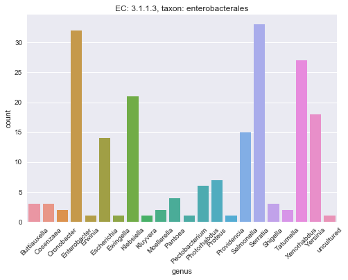
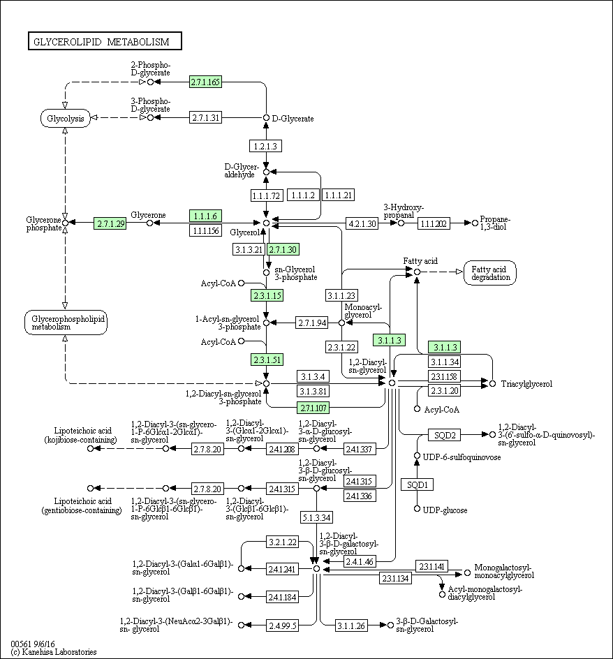
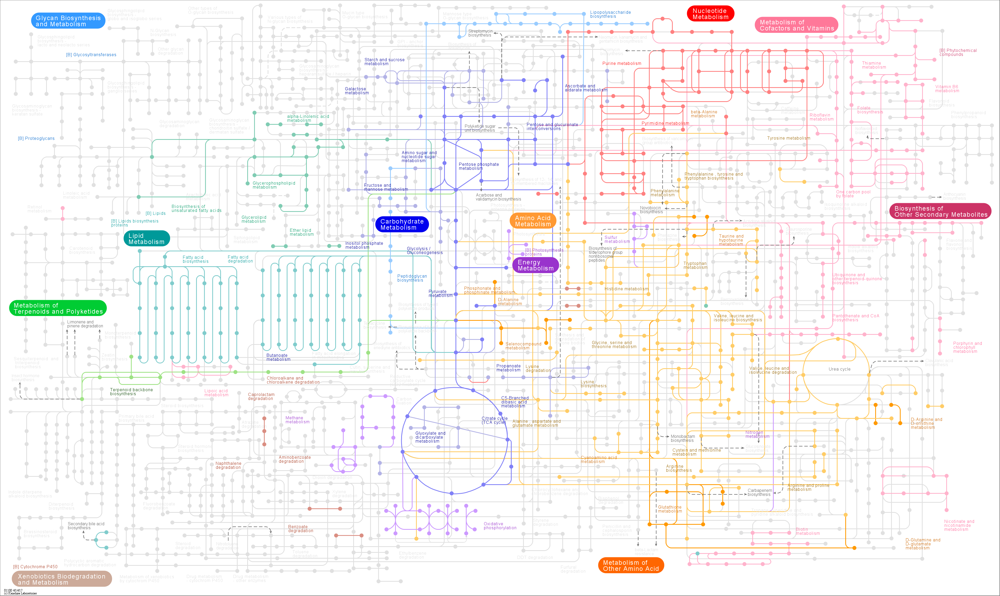

# 03b - An Example Reproducible Document

## Table of Contents

1. [Introduction](#introduction)
2. [Python Imports/Startup](#python_imports)
3. [Biological Motivation](#motivation)
4. [Load Sequence](#load_sequence)
5. [Build `BLAST` database](#build_blast)
6. [Run `BLAST` query](#blast_query)
7. [Load `BLAST` results](#blast_results)
8. [Query `UniProt`](#uniprot)
9. [Query `KEGG`](#uniprot)
10. [Share The Document](#share)

<a id="introduction"></a>
## 1. Introduction

<p></p><div class="alert-success">
<b>This notebook is an example of what could be done in part `03b - Building a Reproducible Document` if more time was available.</b>
</div>

It is provided as a reference against which you can check your work from notebook `03b`, and inspect to get ideas for how you can use the same techniques and methods in your own research.

<a id="python_imports"></a>
## 2. Python Imports/Startup

<p></p><div class="alert-success">
<b>It can be very convenient to have all the `Python` library imports at the top of the notebook.</b>
</div>

This is very helpful when running the notebook with, e.g. `Cell -> Run All` or `Kernel -> Restart & Run All` from the menu bar, all the libraries are available throughout the document.


```python
# The line below allows the notebooks to show graphics inline
%pylab inline

import io                            # This lets us handle streaming data
import os                            # This lets us communicate with the operating system

import pandas as pd                  # This lets us use dataframes
import seaborn as sns                # This lets us draw pretty graphics

# Biopython is a widely-used library for bioinformatics
# tasks, and integrating with software
from Bio import SeqIO                # This lets us handle sequence data
from Bio.KEGG import REST            # This lets us connect to the KEGG databases

# The bioservices library allows connections to common
# online bioinformatics resources
from bioservices import UniProt      # This lets us connect to the UniProt databases

from IPython.display import Image    # This lets us display images (.png etc) from code
```

    Populating the interactive namespace from numpy and matplotlib


<p></p><div class="alert-success">
<b>It can be useful here to create any output directories that will be used throughout the document.</b>
</div>

The `os.makedirs()` function allows us to create a new directory, and the `exist_ok` option will prevent the notebook code from stopping and throwing an error if the directory already exists.


```python
# Create a new directory for notebook output
OUTDIR = os.path.join("data", "reproducible", "output")
os.makedirs(OUTDIR, exist_ok=True)
```

<p></p><div class="alert-success">
<b>It can be useful here to create helper functions that will be used throughout the document.</b>
</div>

The `to_df()` function will turn tabular data into a `pandas` dataframe


```python
# A small function to return a Pandas dataframe, given tabular text
def to_df(result):
    return pd.read_table(io.StringIO(result), header=None)
```

<a id="motivation"></a>
## 3. Biological Motivation

<p></p><div class="alert-info">
<b>We are working on a project to improve bacterial throughput for biosynthesis, and have been provided with a nucleotide sequence of a gene of interest.
<br></br><br></br>
This gene is overrepresented in populations of bacteria that appear to be associated with enhanced metabolic function relevant to a biosynthetic output (lipid conversion to ethanol).
<br></br><br></br>
We want to find out more about the annotated function and literature associated with this gene, which appears to derive from *Proteus mirabilis*.
</div>

Our plan is to:

1. identify a homologue in a reference isolate of *P. mirabilis*
2. obtain the protein sequence/identifier for the homologue
3. get information about the molecular function of this protein from `UniProt`
4. get information about the metabolic function of this protein from `KEGG`
5. visualise some of the information about this gene/protein

<a id="load_sequence"></a>
## 4. Load Sequence

<p></p><div class="alert-success">
<b>We first load the sequence from a local `FASTA` file, using the `Biopython` `SeqIO` library.</b>
</div>

In the `code` cell below:

* we put the path to the sequence file in the variable `seqfile`
* we load the sequence into the variable `wildtype`


```python
# Define the path to the sequence file (in data/reproducible/sequences)
seqfile = os.path.join("data", "reproducible", "sequences", "lipase.fasta")

# Load the sequence data
wildtype = SeqIO.read(seqfile, 'fasta')
```

Once the sequence is loaded, we print it to the notebook to check it is correct.


```python
# Print the 'wildtype' sequence
print(wildtype)
```

    ID: candidate
    Name: candidate
    Description: candidate lipase protein from Proteus mirabilis population
    Number of features: 0
    Seq('ATGAGCACCAAGTACCCCATCGTGCTGGTGCACGGCCTGGCCGGCTTCAGCGAG...CTG', SingleLetterAlphabet())


To see the sequence in `FASTA` format, we can use the `.format()` method:


```python
# Print the 'wildtype' sequence as a FASTA formatted sequence
print(wildtype.format('fasta'))
print(len(wildtype))
```

    >candidate lipase protein from Proteus mirabilis population
    ATGAGCACCAAGTACCCCATCGTGCTGGTGCACGGCCTGGCCGGCTTCAGCGAGATCGTG
    GGCTTCCCCTACTTCTACGGCATCGCCGACGCCCTGACCCAGGACGGCCACCAGGTGTTC
    ACCGCCAGCCTGAGCGCCTTCAACAGCAACGAGGTGAGGGGCAAGCAGCTGTGGCAGTTC
    GTGCAGACCATCCTGCAGGAGACCCAGACCAAGAAGGTGAACTTCATCGGCCACAGCCAG
    GGCCCCCTGGCCTGCAGGTACGTGGCCGCCAACTACCCCGACAGCGTGGCCAGCGTGACC
    AGCATCAACGGCGTGAACCACGGCAGCGAGATCGCCGACCTGTACAGGAGGATCATCAGG
    AAGGACAGCATCCCCGAGTACATCGTGGAGAAGGTGCTGAACGCCTTCGGCACCATCATC
    AGCACCTTCAGCGGCCACAGGGGCGACCCCCAGGACGCCATCGCCGCCCTGGAGAGCCTG
    ACCACCGAGCAGGTGACCGAGTTCAACAACAAGTACCCCCAGGCCCTGCCCAAGACCCCC
    TGCGGCGAGGGCGACGAGATCGTGAACGGCGTGCACTACTACTGCTTCGGCAGCTACATC
    CAGGAGCTGATCGCCGGCGAGAACGGCAACCTGCTGGACCCCACCCACGCCGCCATGAGG
    GTGCTGAACACCCTGTTCACCGAGAAGCAGAACGACGGCCTGGTGGGCAGGTGCAGCATG
    AGGCTGGGCAAGCTGATCAAGGACGACTACGCCCAGGACCACTTCGACATGGTGAACCAG
    GTGGCCGGCCTGGTGAGCTACAACGAGAACATCGTGGCCATCTACACCCTGCACGCCAAG
    TACCTGGCCAGCAAGCAGCTG
    
    861


<a id="build_blast"></a>
## 5. Build `BLAST` Database

<p></p><div class="alert-success">
<b>We now build a local `BLAST` database from the *P. mirabilis* reference proteins.</b>
</div>

* to do this, we run terminal commands in the notebook by using the "*magic*" command `%%bash` at the top of the `code` cell
* using the `%%bash` command makes the rest of the lines in the cell work as though they were the command-line terminal

We build a `BLAST` protein database from the file `data/reproducible/sequences/GCA_000069965.1_ASM6996v1_protein.faa` using the `makeblastdb` command.

<p></p><div class="alert-info">
The output from this command is printed in the notebook below the cell when it runs.
</div>


```python
%%bash
# Drop out to bash to create the BLAST database

# Make a BLAST protein database
makeblastdb -in data/reproducible/sequences/GCA_000069965.1_ASM6996v1_protein.faa \
            -dbtype prot \
            -title reference_protein \
            -out data/reproducible/output/reference_protein
```

    
    
    Building a new DB, current time: 04/16/2017 15:07:01
    New DB name:   /Users/lpritc/Development/GitHub/Teaching-SfAM-ECR/workshop/data/reproducible/output/reference_protein
    New DB title:  reference_protein
    Sequence type: Protein
    Deleted existing Protein BLAST database named /Users/lpritc/Development/GitHub/Teaching-SfAM-ECR/workshop/data/reproducible/output/reference_protein
    Keep MBits: T
    Maximum file size: 1000000000B
    Adding sequences from FASTA; added 3662 sequences in 0.141593 seconds.


<a id="blast_query"></a>
## 6. Run `BLAST` Query

<p></p><div class="alert-success">
<b>We now query the wildtype sequence against our custom `BLAST` database from the *P. mirabilis* reference proteins.</b>
</div>

* to do this, we again run terminal commands in the notebook by using the "*magic*" command `%%bash` at the top of the `code` cell

We `BLASTX` the nucleotide sequence query against the `BLAST` protein database in `data/reproducible/output/reference_protein`.

<p></p><div class="alert-info">
We set the `BLAST` output format to `6` (tabular) format, so we can read it in with `pandas`.
<br></br><br></br>
<b>The `BLASTX` command does not produce output in the notebook, if it is successful</b>
<br></br><br></br>
We have named the `BLASTX` output file in such a way that we can tell what the query was, what the database was, and which `BLAST` program was used. This makes it easier to identify results when looking through output files.
</div>


```python
%%bash
# Drop out to bash to run the BLASTX query

blastx -query data/reproducible/sequences/lipase.fasta \
        -db data/reproducible/output/reference_protein \
        -outfmt 6 \
        -out data/reproducible/output/wildtype_blastx_reference_protein.tab
```

<a id="blast_results"></a>
## 7. Load `BLAST` Results

<p></p><div class="alert-success">
<b>We now load the `BLASTX` results for inspection and visualisation, using `pandas`</b>
</div>

* we use the `pandas` `read_csv()` function to load the tabular data that was created using the option `-outfmt 6` in the `blastx` command
* we define column headers, to make the tabular results easier to understand

<p></p><div class="alert-info">
The tabular format is tab-separated, so we need to specify `sep="\t"` as the separator.
<br></br><br></br>
The tabular output has no header row, so we need to specify `header=None`
<br></br><br></br>
We add column headers to the dataframe *after* it is loaded
</div>


```python
# Define the path to the output file
blastfile = os.path.join("data", "reproducible", "output",
                         "wildtype_blastx_reference_protein.tab")

# Define column headers
# These are the default columns produced with -outfmt 6
headers = ['query', 'subject',
           'pc_identity', 'aln_length',
           'mismatches', 'gaps_opened',
           'query_start', 'query_end',
           'subject_start', 'subject_end',
           'e_value', 'bitscore']

# Load the BLAST output into a dataframe
results = pd.read_csv(blastfile, sep="\t", header=None)
results.columns = headers
```

We can now inspect the first few rows of the dataframe, to see what the best hits were in the reference genome:


```python
# Show first few rows of the dataframe
results.head()
```


<div>
<table border="1" class="dataframe">
  <thead>
    <tr style="text-align: right;">
      <th></th>
      <th>query</th>
      <th>subject</th>
      <th>pc_identity</th>
      <th>aln_length</th>
      <th>mismatches</th>
      <th>gaps_opened</th>
      <th>query_start</th>
      <th>query_end</th>
      <th>subject_start</th>
      <th>subject_end</th>
      <th>e_value</th>
      <th>bitscore</th>
    </tr>
  </thead>
  <tbody>
    <tr>
      <th>0</th>
      <td>candidate</td>
      <td>CAR42190.1</td>
      <td>95.122</td>
      <td>287</td>
      <td>14</td>
      <td>0</td>
      <td>1</td>
      <td>861</td>
      <td>1</td>
      <td>287</td>
      <td>0.00</td>
      <td>567.0</td>
    </tr>
    <tr>
      <th>1</th>
      <td>candidate</td>
      <td>CAR41557.1</td>
      <td>28.947</td>
      <td>76</td>
      <td>44</td>
      <td>3</td>
      <td>598</td>
      <td>795</td>
      <td>93</td>
      <td>168</td>
      <td>0.59</td>
      <td>28.1</td>
    </tr>
    <tr>
      <th>2</th>
      <td>candidate</td>
      <td>CAR45487.1</td>
      <td>34.043</td>
      <td>47</td>
      <td>31</td>
      <td>0</td>
      <td>235</td>
      <td>375</td>
      <td>131</td>
      <td>177</td>
      <td>0.78</td>
      <td>27.7</td>
    </tr>
    <tr>
      <th>3</th>
      <td>candidate</td>
      <td>CAR42262.1</td>
      <td>43.478</td>
      <td>23</td>
      <td>13</td>
      <td>0</td>
      <td>727</td>
      <td>795</td>
      <td>191</td>
      <td>213</td>
      <td>1.60</td>
      <td>26.9</td>
    </tr>
    <tr>
      <th>4</th>
      <td>candidate</td>
      <td>CAR42804.1</td>
      <td>32.258</td>
      <td>31</td>
      <td>21</td>
      <td>0</td>
      <td>721</td>
      <td>813</td>
      <td>33</td>
      <td>63</td>
      <td>3.10</td>
      <td>24.3</td>
    </tr>
  </tbody>
</table>
</div>


There is a single best match - `CAR42190.1` - that aligns over the full length of the candidate sequence (`861/3 = 287`) with 95% identity and 14 residue mismatches.

It is very likely that this protein shares the same molecular and metabolic function as our candidate sequence, so we proceed to query the `UniProt` and `KEGG` databases.

<a id="uniprot"></a>
## 8. Query `UniProt`

<p></p><div class="alert-success">
<b>We now query the `UniProt` databases for information on our best match</b>
</div>

* we use the `bioservices` library to make a connection to the remote `UniProt` servers, and make our query
* we ask for the query results to be returned as a `pandas` dataframe, for ease of processing

<p></p><div class="alert-info">
We set up a connection to the service with the `UniProt()` class, putting this in a variable called `service`
<br></br><br></br>
We can make many queries to the same service, using the `.search()` method
<br></br><br></br>
The default results from `UniProt` can be quite sparse, so we'll ask for them in a different format shortly.
</div>


```python
# Make a link to the UniProt webservice
service = UniProt()

# Make a new query string, and run a remote search for the UniProt entry
query = "CAR42190"
result = service.search(query)

# Inspect the result
print(result)
```

    Entry	Entry name		Protein names	Gene names	Organism	Length
    B4EVM3	B4EVM3_PROMH	unreviewed	Putative lipase (EC 3.1.1.3)	PMI0999	Proteus mirabilis (strain HI4320)	287
    


This result tells us that the `UniProt` record for this sequence has the accession `B4EVM3` (not the `CAR42190` that we first thought), and that it is a putative lipase sequence that has been assigned the Enzyme Classification number `EC 3.1.1.3`.

<p></p><div class="alert-warning">
<b>The `UniProt` output tells us that the gene name of record for this sequence is `PMI0999`. This will be important for our `KEGG` query.</b>
</div>

* the EC number will also be useful when querying `KEGG` later

<p></p><div class="alert-success">
<b>We can also ask for the query results to be returned as a `pandas` dataframe, for ease of processing, with the `service.get_df()` function:</b>
</div>


```python
# Get a dataframe from UniProt
uniprot_df = service.get_df(query)

# View the dataframe
uniprot_df.head()
```


<div>
<table border="1" class="dataframe">
  <thead>
    <tr style="text-align: right;">
      <th></th>
      <th>Entry</th>
      <th>Entry name</th>
      <th>Gene names</th>
      <th>Gene names  (primary )</th>
      <th>Gene names  (synonym )</th>
      <th>Gene names  (ordered locus )</th>
      <th>Gene names  (ORF )</th>
      <th>Organism</th>
      <th>Organism ID</th>
      <th>Protein names</th>
      <th>...</th>
      <th>Miscellaneous [CC]</th>
      <th>Keywords</th>
      <th>Protein existence</th>
      <th>Unnamed: 93</th>
      <th>Sequence annotation (Features)</th>
      <th>Protein families</th>
      <th>Version</th>
      <th>Comments</th>
      <th>Cross-reference (null)</th>
      <th>Pathway.1</th>
    </tr>
  </thead>
  <tbody>
    <tr>
      <th>0</th>
      <td>B4EVM3</td>
      <td>B4EVM3_PROMH</td>
      <td>[PMI0999]</td>
      <td>NaN</td>
      <td>NaN</td>
      <td>PMI0999</td>
      <td>NaN</td>
      <td>Proteus mirabilis (strain HI4320)</td>
      <td>529507</td>
      <td>Putative lipase (EC 3.1.1.3)</td>
      <td>...</td>
      <td>NaN</td>
      <td>[3D-structure, Calcium, Complete proteome, Hyd...</td>
      <td>Evidence at protein level</td>
      <td>unreviewed</td>
      <td>NaN</td>
      <td>[]</td>
      <td>53</td>
      <td>[]</td>
      <td>NaN</td>
      <td>NaN</td>
    </tr>
  </tbody>
</table>
<p>1 rows × 100 columns</p>
</div>


This dataframe gives us much more information (100 columns of data - we can see the headers with `uniprot_df.columns`) than the initial result. We can see that there is a 3D structure for the protein, and that there is evidence for its existence at the protein level.

<p></p><div class="alert-info">
`UniProt` can provide much more information than this if asked explicitly, using the same syntax as you would at the `UniProt` website.
<br></br><br></br>
We can look at the distribution of enzymes annotated with this EC number across Enterobacterales genera, using a new `UniProt` query, and some useful functions of dataframes.
<br></br><br></br>
To do this, we'll write a function that allows us to pass an EC number, and taxonomic classification, and produces a histogram of how many examples are found per genus.
</div>


```python
# A function to plot the number of enzymes annotated with a given
# EC number, per genus, under a specified taxonomic classification.
def hist_enzymes_by_genus(ec=None, taxon=None):
    """Plots a histogram of enzymes with passed EC number, per
    genus, under the indicated taxon.
    """
    # Ask UniProt for all proteins with EC number under the passed
    # taxon
    query = "ec:%s taxonomy:%s" % (ec, taxon)
    uniprot_df = service.get_df(query)

    # How many sequences are returned?
    print("UniProt reports %i sequences (EC: %s, taxon: %s)" %
          (len(uniprot_df), ec, taxon))
    
    # Create a new column for  the genus of the organism
    uniprot_df['genus'] = uniprot_df['Organism'].str.split().str.get(0)
    
    # Count the number of enzymes per genus
    genus_count = uniprot_df.groupby('genus')['Entry'].count()
    
    # Plot the number of enzymes per genus
    g = sns.barplot(genus_count.index, genus_count);
    g.set_xticklabels(labels=genus_count.index, rotation=45);
    g.set_title("EC: %s, taxon: %s" % (ec, taxon));
    g.set_ylabel("count")
    
    # Return the plot
    return g
```


```python
# Call function to plot the number of enzymes in each genus
hist_enzymes_by_genus(ec="3.1.1.3", taxon="enterobacterales");
```

    UniProt reports 198 sequences (EC: 3.1.1.3, taxon: enterobacterales)





<a id="kegg"></a>
## 9. Query `KEGG`

<p></p><div class="alert-success">
<b>We now query the `KEGG` databases for information on our best match</b>
</div>

* we use the `Biopython` library to make a connection to the remote `KEGG` servers, and make our query
* we use the `to_df()` function to turn the tabular query results from `KEGG` into a `pandas` dataframe, for ease of processing
* the `UniProt` result tells us that the gene name is `PMI0999`, so we use this as our query
* `KEGG` is composed of several databases, and we need to tell it which database we are serching in, as well as our query

<p></p><div class="alert-info">
We use the `KEGG.REST` module to connect to the `KEGG` databases.
<br></br><br></br>
We first search in the `GENES` database to see what `KEGG` knows about our sequence, and what `KEGG`'s internal ID is (we will need this)
<br></br><br></br>
We use the `REST.kegg_find()` function to identify `KEGG`'s internal identifier for this sequence, so we can access further records
</div>


```python
# Find KEGG GENES result for the query PMI0999
result = REST.kegg_find("genes", "PMI0999").read()     # Do search at KEGG
to_df(result)                                          # convert to a dataframe
```


<div>
<table border="1" class="dataframe">
  <thead>
    <tr style="text-align: right;">
      <th></th>
      <th>0</th>
      <th>1</th>
    </tr>
  </thead>
  <tbody>
    <tr>
      <th>0</th>
      <td>pmr:PMI0999</td>
      <td>K01046 triacylglycerol lipase [EC:3.1.1.3] | (...</td>
    </tr>
  </tbody>
</table>
</div>


The first search tells us that `KEGG`'s internal ID for our query sequence is `pmr:PMI0999`.

<p></p><div class="alert-success">
<b>We now use the `REST.kegg_get()` function to extract the record information</b>
</div>


```python
# Get the KEGG GENES entry for pmr:PMI0999
result = REST.kegg_get("pmr:PMI0999").read()
print(result)
```

    ENTRY       PMI0999           CDS       T00753
    DEFINITION  (GenBank) putative lipase
    ORTHOLOGY   K01046  triacylglycerol lipase [EC:3.1.1.3]
    ORGANISM    pmr  Proteus mirabilis HI4320
    PATHWAY     pmr00561  Glycerolipid metabolism
                pmr01100  Metabolic pathways
    BRITE       KEGG Orthology (KO) [BR:pmr00001]
                 Metabolism
                  Lipid metabolism
                   00561 Glycerolipid metabolism
                    PMI0999
                Enzymes [BR:pmr01000]
                 3. Hydrolases
                  3.1  Acting on ester bonds
                   3.1.1  Carboxylic-ester hydrolases
                    3.1.1.3  triacylglycerol lipase
                     PMI0999
    POSITION    1063081..1063944
    MOTIF       Pfam: Abhydrolase_1 DUF676 Lipase_2 DUF915 BAAT_C Hydrolase_4 FliG_N Abhydrolase_6
    DBLINKS     NCBI-ProteinID: CAR42190
                UniProt: B4EVM3
    STRUCTURE   PDB: 4HS9 3W9U 4GW3 4GXN
    AASEQ       287
                MSTKYPIVLVHGLAGFNEIVGFPYFYGIADALRQDGHQVFTASLSAFNSNEVRGKQLWQF
                VQTLLQETQAKKVNFIGHSQGPLACRYVAANYPDSVASVTSINGVNHGSEIADLYRRIMR
                KDSIPEYIVEKVLNAFGTIISTFSGHRGDPQDAIAALESLTTEQVTEFNNKYPQALPKTP
                GGEGDEIVNGVHYYCFGSYIQGLIAGEKGNLLDPTHAAMRVLNTFFTEKQNDGLVGRSSM
                RLGKLIKDDYAQDHIDMVNQVAGLVGYNEDIVAIYTQHAKYLASKQL
    NTSEQ       864
                atgtcaacgaaatatcctatcgttttagttcatggtttagctggttttaatgaaattgtt
                ggttttccctacttttatggtattgcagatgccttaaggcaagatgggcatcaagttttt
                accgcttctctttctgcctttaattcaaatgaagtgcgtggcaagcagttgtggcaattt
                gtccagactctcttacaagagacacaagcgaaaaaagtgaattttataggtcatagccaa
                gggccattagcttgtcgttacgttgcggctaattatcctgatagtgttgcttcggtaact
                tcaattaatggtgtaaatcatggttcagaaatagccgacttatatcgacgcattatgcgt
                aaagacagtatcccagaatatattgtcgaaaaagtattaaatgcatttggtactattatc
                tcaacattttctggtcatagaggcgatcctcaagatgctattgccgcattagagtcttta
                acaacagagcaagtcacagaatttaataacaaatacccacaggcattacctaaaacccct
                ggtggtgaaggtgatgaaatcgtcaatggggttcattactactgttttggtagctatatt
                cagggattaattgctggggaaaaggggaatctactggatcctactcatgcggcaatgcgt
                gtgttaaatacattctttactgaaaaacaaaatgacggcttagttggtcgctcgagtatg
                cgattaggcaaattgataaaagatgattatgcgcaagatcatattgatatggttaaccaa
                gttgcagggttagtgggttataatgaagatatcgttgctatttatactcagcacgctaaa
                tacttagcgagtaagcaactttaa
    ///
    


From this entry we can see that:

* our protein is annotated as a triglycerol lipase
* it participates in two metabolic pathways: Glycerolipid metabolism [`pmr00561`] and central metabolism [`pmr01100`]
* the protein has eight annotated motifs in `PFam`
* there are cross-references to several databases, including four structures in RCSB/PDB

<p></p><div class="alert-success">
<b>We want to visualise the pathway that our gene product participates in</b>
</div>

* `KEGG` stores pathways in a separate database to genes, the `PATHWAY` database
* we can use `REST.kegg_get()` to get the text description of a pathway, and also the `KEGG` database image for that pathway.

<p></p><div class="alert-info">
We use the `REST.kegg_get()` function to obtain the pathway entry as text.
</div>


```python
# Get the KEGG PATHWAY entry for our gene in plain text
pathway = REST.kegg_get("pmr00561").read()
print(pathway)
```

    ENTRY       pmr00561                    Pathway
    NAME        Glycerolipid metabolism - Proteus mirabilis HI4320
    CLASS       Metabolism; Lipid metabolism
    PATHWAY_MAP pmr00561  Glycerolipid metabolism
    DBLINKS     BSID: 73017
                GO: 0045017 0046486 0046503
    ORGANISM    Proteus mirabilis HI4320 [GN:pmr]
    GENE        PMI3609  garK; glycerate kinase [KO:K00865] [EC:2.7.1.165]
                PMI2402  dhaK; PTS-dependent dihydroxyacetone kinase, dihydroxyacetone-binding subunit [KO:K05878] [EC:2.7.1.-]
                PMI1231  dhaK1; dihydroxyacetone kinase (glycerone kinase), kinase subunit [KO:K05878] [EC:2.7.1.-]
                PMI1232  dhaK2; dihydroxyacetone kinase, phosphatase subunit [KO:K05879] [EC:2.7.1.-]
                PMI2403  dhaL; PTS-dependent dihydroxyacetone kinase, ADP-binding subunit [KO:K05879] [EC:2.7.1.-]
                PMI3595  gldA; glycerol dehydrogenase [KO:K00005] [EC:1.1.1.6]
                PMI2766  putative glycerol dehydrogenase [KO:K00005] [EC:1.1.1.6]
                PMI3210  glpK; glycerol kinase [KO:K00864] [EC:2.7.1.30]
                PMI2751  plsB; glycerol-3-phosphate acyltransferase [KO:K00631] [EC:2.3.1.15]
                PMI0858  plsX; fatty acid/phospholipid synthesis protein [KO:K03621] [EC:2.3.1.15]
                PMI2364  putative membrane protein [KO:K08591] [EC:2.3.1.15]
                PMI2343  plsC; 1-acyl-glycerol-3-phosphate acyltransferase [KO:K00655] [EC:2.3.1.51]
                PMI2750  dgkA; diacylglycerol kinase [KO:K00901] [EC:2.7.1.107]
                PMI0999  putative lipase [KO:K01046] [EC:3.1.1.3]
    COMPOUND    C00029  UDP-glucose
                C00040  Acyl-CoA
                C00093  sn-Glycerol 3-phosphate
                C00111  Glycerone phosphate
                C00116  Glycerol
                C00162  Fatty acid
                C00184  Glycerone
                C00197  3-Phospho-D-glycerate
                C00258  D-Glycerate
                C00416  Phosphatidate
                C00422  Triacylglycerol
                C00577  D-Glyceraldehyde
                C00631  2-Phospho-D-glycerate
                C00641  1,2-Diacyl-sn-glycerol
                C00681  1-Acyl-sn-glycerol 3-phosphate
                C00969  3-Hydroxypropanal
                C01885  1-Acylglycerol
                C02457  Propane-1,3-diol
                C03692  1,2-Diacyl-3-beta-D-galactosyl-sn-glycerol
                C04046  3-D-Glucosyl-1,2-diacylglycerol
                C04315  2-Acyl-3-O-(beta-D-galactosyl)-sn-glycerol
                C04872  1,2-Diacyl-3-[3-(alpha-D-N-acetylneuraminyl)-beta-D-galactosyl]-sn-glycerol
                C05401  3-beta-D-Galactosyl-sn-glycerol
                C06037  Digalactosyl-diacylglycerol
                C06038  Acyl1-monogalactosyl-diacylglycerol
                C06040  Diglucosyldiacylglycerol
                C06041  Glycerophosphoglycoglycerolipid
                C06042  Lipoteichoic acid
                C06364  1,2-Diacyl-3-alpha-D-glucosyl-sn-glycerol
                C06365  alpha-Kojibiosyldiacylglycerol
                C11521  UDP-6-sulfoquinovose
                C13508  Sulfoquinovosyldiacylglycerol
                C20897  Glycerophosphoglycoglycerolipid
                C20898  Lipoteichoic acid
                C20991  1,2-Diacyl-3-O-[beta-D-galactosyl-(1->6)-beta-D-galactosyl]-sn-glycerol
    REFERENCE   PMID:8662716
      AUTHORS   Norbeck J, Pahlman AK, Akhtar N, Blomberg A, Adler L.
      TITLE     Purification and characterization of two isoenzymes of DL-glycerol-3-phosphatase from Saccharomyces cerevisiae. Identification of the corresponding GPP1 and GPP2 genes and evidence for osmotic regulation of Gpp2p expression by the osmosensing mitogen-activated protein kinase signal transduction pathway.
      JOURNAL   J Biol Chem 271:13875-81 (1996)
    REFERENCE   PMID:8995384
      AUTHORS   Karlsson OP, Dahlqvist A, Vikstrom S, Wieslander A.
      TITLE     Lipid dependence and basic kinetics of the purified 1,2-diacylglycerol 3-glucosyltransferase from membranes of Acholeplasma laidlawii.
      JOURNAL   J Biol Chem 272:929-36 (1997)
    REFERENCE   PMID:11294844
      AUTHORS   Berg S, Edman M, Li L, Wikstrom M, Wieslander A.
      TITLE     Sequence properties of the 1,2-diacylglycerol 3-glucosyltransferase from Acholeplasma laidlawii membranes. Recognition of a large group of lipid glycosyltransferases in eubacteria and archaea.
      JOURNAL   J Biol Chem 276:22056-63 (2001)
    KO_PATHWAY  ko00561
    ///
    


This query has given us the full text of the entry, including:

* the identifiers for every enzyme and compound involved in the pathway
* references for literature concerning the pathway
* Gene Ontology (GO) terms associated with the pathway

<p></p><div class="alert-info">
We use the `REST.kegg_get()` function to obtain the pathway entry as an image.
<br></br>
To do this, we need to specify the `"image"` argument when we call the function.
</div>


```python
pathway_img = REST.kegg_get("pmr00561", "image").read()
Image(pathway_img)
```





This now renders the `KEGG` pathway image for `pmr00561`, with the enzymes that are present in our organism (*Proteus mirabilis*) highlighted in green.

<p></p><div class="alert-info">
We can use the `REST.kegg_get()` function in the same way to get a map of central metabolism for *P. mirabilis*:
</div>


```python
# Get the central metabolism image for P. mirabilis
metabolism_img = REST.kegg_get("pmr01100", "image").read()
Image(metabolism_img)
```





<a id="share"></a>
## 10. Share The Document

<p></p><div class="alert-success">
<b>Notebooks are convenient for making work reproducible, and part of that is sharing the notebook for reuse.</b>
</div>

We can now share our notebook summarising what we know about our candidate sequence in a number of ways, using the `File -> Download as` options in the menu bar. These are summarised below, with links to example output.

* `Notebook (.ipynb)`: This will allow others to open the notebook and interact with it just as we are doing now, in Jupyter. ([`example.ipynb`](data/reproducible/example_output/example.ipynb))
* `Python (.py)`: This will extract the `Python` code from the notebook into a file that can be run as a plain `Python` script. ([`example.py`](data/reproducible/example_output/example.py))
* `HTML (.html)`: This will render the notebook in HTML format, so it can be viewed, but not interacted with, in a web browser. ([`example.html`](data/reproducible/example_output/example.html))
* `Markdown (.md)`: This will render the notebook in `Markdown` format, so it can be edited as a plaintext document, or converted to a new output format. ([`example.md`](data/reproducible/example_output/example.md))

<p></p><div class="alert-info">
Services such as GitHub can help you share your notebooks and work with a much wider audience.
<br></br>
Where a notebook can help others understand your publication, they can be included as supplementary information, or made available publicly and linked to from your manuscript.
</div>
